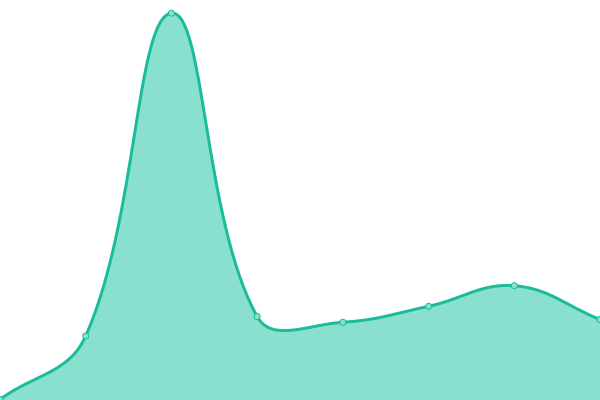

# [📈 Live Status](https://status.jonathanbout.dev): <!--live status--> **🟧 Partial outage**

This repository contains the open-source uptime monitor and status page for [Jonathan Bout](jonathanbout.com), powered by [Upptime](https://github.com/upptime/upptime).

With [Upptime](https://upptime.js.org), you can get your own unlimited and free uptime monitor and status page, powered entirely by a GitHub repository. We use [Issues](https://github.com/JonathanBout/upptime/issues) as incident reports, [Actions](https://github.com/JonathanBout/upptime/actions) as uptime monitors, and [Pages](https://status.jonathanbout.dev) for the status page.

<!--start: status pages-->
<!-- This summary is generated by Upptime (https://github.com/upptime/upptime) -->
<!-- Do not edit this manually, your changes will be overwritten -->
<!-- prettier-ignore -->
| URL | Status | History | Response Time | Uptime |
| --- | ------ | ------- | ------------- | ------ |
|  [Portfolio (.com)](https://jonathanbout.com?changeLocale=true) | 🟥 Down | [portfolio-com.yml](https://github.com/JonathanBout/upptime/commits/HEAD/history/portfolio-com.yml) | 

 3641ms
     
 | 

<a href="https://status.jonathanbout.dev/history/portfolio-com">98.77%</a>
    

|  [Portfolio (.nl)](https://jonathanbout.nl?changeLocale=true) | 🟥 Down | [portfolio-nl.yml](https://github.com/JonathanBout/upptime/commits/HEAD/history/portfolio-nl.yml) | 

 1762ms
     
 | 

<a href="https://status.jonathanbout.dev/history/portfolio-nl">99.04%</a>
    

|  [Portfolio Backend](https://jonathanbout.com/api/_health/first-party?simple=true) | 🟥 Down | [portfolio-backend.yml](https://github.com/JonathanBout/upptime/commits/HEAD/history/portfolio-backend.yml) | 

 1752ms
     
 | 

<a href="https://status.jonathanbout.dev/history/portfolio-backend">98.54%</a>
    

|  [Astronomy Picture Of the Day](https://apod.jonathanbout.com) | 🟨 Degraded | [astronomy-picture-of-the-day.yml](https://github.com/JonathanBout/upptime/commits/HEAD/history/astronomy-picture-of-the-day.yml) | 

 3548ms
     
 | 

<a href="https://status.jonathanbout.dev/history/astronomy-picture-of-the-day">98.37%</a>
    

|  [Content Delivery Server](https://static.jonathanbout.dev/_cdn/server/health) | 🟩 Up | [content-delivery-server.yml](https://github.com/JonathanBout/upptime/commits/HEAD/history/content-delivery-server.yml) | 

 153ms
     
 | 

<a href="https://status.jonathanbout.dev/history/content-delivery-server">100.00%</a>
    

<!--end: status pages-->

[**Visit our status website →**](https://status.jonathanbout.dev)

## 📄 License

- Powered by: [Upptime](https://github.com/upptime/upptime)
- Code: [MIT](./LICENSE) © [Anand Chowdhary](https://anandchowdhary.com), supported by [Pabio](https://pabio.com)
- Data in the `./history` directory: [Open Database License](https://opendatacommons.org/licenses/odbl/1-0/)
